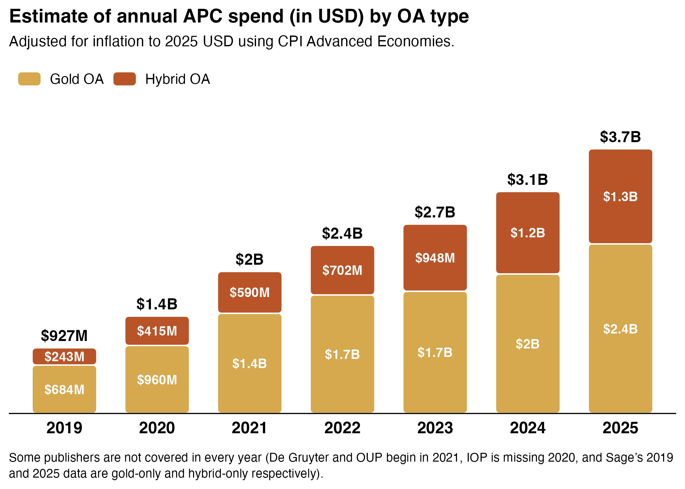
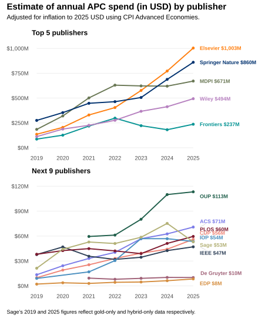
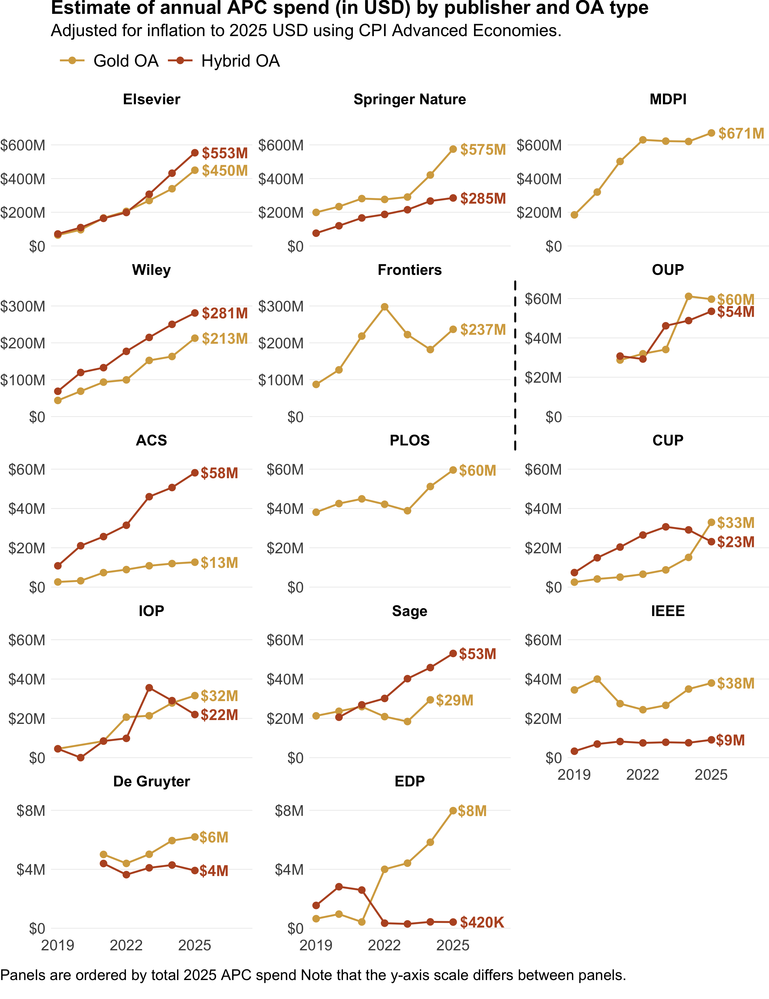
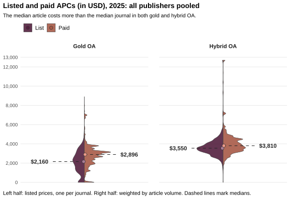
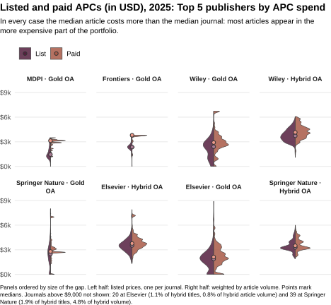
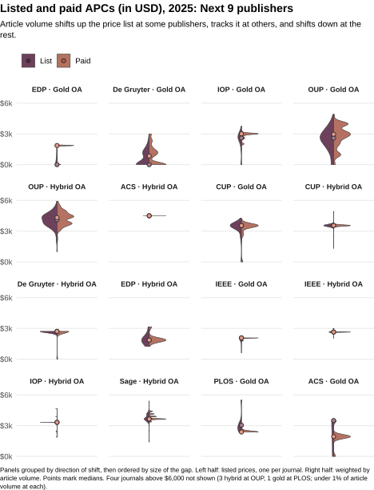

roara_apc_paper
================
Lisa Matthias
2026-07-03

# Methods

## Main numbers

Number of records in the dataset

    ## [1] 69856

Number of journals in the dataset

    ## [1] 12540

## Currency numbers

Number of flat rate APCs in the dataset

    ## [1] 68506

Original vs. converted currency, flat-rate APCs

    ## [1] 94

## Fee-type breakdown

    ## # A tibble: 15 × 2
    ##    type_of_fee                                               n
    ##    <chr>                                                 <int>
    ##  1 apc scale                                                 2
    ##  2 editorial processing charge                               1
    ##  3 flat rate                                             68506
    ##  4 flat rate + overlength charge                           395
    ##  5 flat rate + page charge                                 135
    ##  6 flat rate + publication charge                            4
    ##  7 flat rate + submission fee                                1
    ##  8 flat rate + voluntary page charge                        35
    ##  9 flat rate + voluntary page charge + overlength charge   236
    ## 10 liberty apc                                              22
    ## 11 page charge                                              22
    ## 12 page charge + reviewing fee                               2
    ## 13 quanta charge                                            25
    ## 14 rapid service fee                                        38
    ## 15 unknown                                                 432

## OA status

    ## # A tibble: 3 × 2
    ##   oa_status     n
    ##   <chr>     <int>
    ## 1 Gold OA   19037
    ## 2 Hybrid OA 50796
    ## 3 unknown      23

Gold OA journal-year combinations with known APCs

    ## [1] 18647

Gold OA journal-year combinations with APC \> 0

    ## [1] 16663

Hybrid OA journal-year combinations with known APCs

    ## [1] 50747

# Results

<table class="table" style="width: auto !important; margin-left: auto; margin-right: auto;">

<caption>

Table 1. Estimate of annual APC spend (in millions USD) per OA type for
actual APCs paid and adjusted for inflation using CPI Advanced
Economies.
</caption>

<thead>

<tr>

<th style="empty-cells: hide;border-bottom:hidden;" colspan="1">

</th>

<th style="border-bottom:hidden;padding-bottom:0; padding-left:3px;padding-right:3px;text-align: center; " colspan="2">

Spend estimate based on APCs in USD (actual list price)

</th>

<th style="border-bottom:hidden;padding-bottom:0; padding-left:3px;padding-right:3px;text-align: center; " colspan="2">

Spend estimate based on APCs in USD (adjusted to 2025 prices)

</th>

</tr>

<tr>

<th style="text-align:left;">

Publication year
</th>

<th style="text-align:right;">

Gold
</th>

<th style="text-align:right;">

Hybrid
</th>

<th style="text-align:right;">

Gold
</th>

<th style="text-align:right;">

Hybrid
</th>

</tr>

</thead>

<tbody>

<tr>

<td style="text-align:left;">

2019
</td>

<td style="text-align:right;">

558.26
</td>

<td style="text-align:right;">

198.72
</td>

<td style="text-align:right;">

683.87
</td>

<td style="text-align:right;">

243.44
</td>

</tr>

<tr>

<td style="text-align:left;">

2020
</td>

<td style="text-align:right;">

788.59
</td>

<td style="text-align:right;">

340.94
</td>

<td style="text-align:right;">

959.72
</td>

<td style="text-align:right;">

414.92
</td>

</tr>

<tr>

<td style="text-align:left;">

2021
</td>

<td style="text-align:right;">

1198.32
</td>

<td style="text-align:right;">

500.24
</td>

<td style="text-align:right;">

1414.01
</td>

<td style="text-align:right;">

590.29
</td>

</tr>

<tr>

<td style="text-align:left;">

2022
</td>

<td style="text-align:right;">

1520.84
</td>

<td style="text-align:right;">

638.00
</td>

<td style="text-align:right;">

1672.93
</td>

<td style="text-align:right;">

701.80
</td>

</tr>

<tr>

<td style="text-align:left;">

2023
</td>

<td style="text-align:right;">

1640.15
</td>

<td style="text-align:right;">

900.82
</td>

<td style="text-align:right;">

1725.43
</td>

<td style="text-align:right;">

947.66
</td>

</tr>

<tr>

<td style="text-align:left;">

2024
</td>

<td style="text-align:right;">

1921.14
</td>

<td style="text-align:right;">

1136.17
</td>

<td style="text-align:right;">

1969.16
</td>

<td style="text-align:right;">

1164.57
</td>

</tr>

<tr>

<td style="text-align:left;">

2025
</td>

<td style="text-align:right;">

2393.63
</td>

<td style="text-align:right;">

1342.63
</td>

<td style="text-align:right;">

2393.63
</td>

<td style="text-align:right;">

1342.63
</td>

</tr>

<tr>

<td style="text-align:left;">

NA
</td>

<td style="text-align:right;">

10020.93
</td>

<td style="text-align:right;">

5057.52
</td>

<td style="text-align:right;">

10818.76
</td>

<td style="text-align:right;">

5405.31
</td>

</tr>

</tbody>

</table>

## OA type

### Figure 2. Estimate of annual APC spend (in USD) per OA type, adjusted for inflation to 2025 USD using CPI Advanced Economies.

### Numbers for plot description

Gold share of total spend across all years

    ## # A tibble: 2 × 3
    ##   oa_status total_m  share
    ##   <fct>     <chr>    <chr>
    ## 1 Gold OA   10818.76 66.68
    ## 2 Hybrid OA 5405.31  33.32

Growth 2019 → 2025, per OA type

    ## # A tibble: 2 × 4
    ##   oa_status y2019  y2025   growth_pct
    ##   <fct>     <chr>  <chr>   <chr>     
    ## 1 Gold OA   683.87 2393.63 250.01    
    ## 2 Hybrid OA 243.44 1342.63 451.54

## Publishers

### Figure 3. Estimate of annual APC spend (in USD) by publisher adjusted for inflation to 2025 USD using CPI Advanced Economies.

(For the published figure, label positioning was adjusted with Adobe
Illustrator)

#### Numbers for plot description

MDPI gold output, 2022–2024

    ## # A tibble: 3 × 3
    ##    year total_apcable chg_from_2022
    ##   <dbl>         <dbl>         <dbl>
    ## 1  2022        263767          0   
    ## 2  2023        249877         -5.27
    ## 3  2024        217974        -17.4

Frontiers spend trend, 2022–2024

    ## # A tibble: 3 × 4
    ##   apc_year total_m pct_change_from_2022 yoy_pct_change
    ##      <dbl> <chr>   <chr>                <chr>         
    ## 1     2022 297.81  0.00                 NA            
    ## 2     2023 222.31  -25.40               -25.40        
    ## 3     2024 181.71  -39.00               -18.30

MDPI, Frontiers, and Wiley gold output change, 2022–2023

    ## # A tibble: 3 × 4
    ##   publisher  y2022  y2023 pct_change
    ##   <chr>      <dbl>  <dbl>      <dbl>
    ## 1 FRONTIERS  98847  69450     -29.7 
    ## 2 MDPI      263767 249877      -5.27
    ## 3 WILEY      30305  42275      39.5

IEEE spend growth, 2019–2025

    ## # A tibble: 1 × 3
    ##   y2019 y2025 growth_pct
    ##   <dbl> <dbl>      <dbl>
    ## 1  37.8  47.1       24.6

### Figure 4. Estimate of annual APC revenue (in USD) by publisher and OA type adjusted for inflation to 2025 USD using CPI Advanced Economies.

    ## quartz_off_screen 
    ##                 2

### Table 2. Growth of article output and APC spend (adjusted for inflation to 2025 USD using CPI Advanced Economies) from 2019 to 2025 per publisher and OA type.

<table class="table" style="width: auto !important; margin-left: auto; margin-right: auto;">

<caption>

Table 2. Growth of article output and APC spend (adjusted for inflation
to 2025 USD using CPI Advanced Economies) from 2019 to 2025 per
publisher and OA type.
</caption>

<thead>

<tr>

<th style="empty-cells: hide;border-bottom:hidden;" colspan="1">

</th>

<th style="border-bottom:hidden;padding-bottom:0; padding-left:3px;padding-right:3px;text-align: center; " colspan="3">

Number of APC-able publications

</th>

<th style="border-bottom:hidden;padding-bottom:0; padding-left:3px;padding-right:3px;text-align: center; " colspan="3">

Spend estimate based on APCs in USD (adjusted to 2025 prices)

</th>

</tr>

<tr>

<th style="text-align:left;">

Publisher
</th>

<th style="text-align:right;">

Gold+Hybrid
</th>

<th style="text-align:right;">

Gold
</th>

<th style="text-align:right;">

Hybrid
</th>

<th style="text-align:right;">

Gold+Hybrid
</th>

<th style="text-align:right;">

Gold
</th>

<th style="text-align:right;">

Hybrid
</th>

</tr>

</thead>

<tbody>

<tr>

<td style="text-align:left;">

All publishers
</td>

<td style="text-align:right;">

+237.6%
</td>

<td style="text-align:right;">

+196.5%
</td>

<td style="text-align:right;">

+427.4%
</td>

<td style="text-align:right;">

+302.9%
</td>

<td style="text-align:right;">

+250.0%
</td>

<td style="text-align:right;">

+451.5%
</td>

</tr>

<tr>

<td style="text-align:left;">

ACS
</td>

<td style="text-align:right;">

+326.9%
</td>

<td style="text-align:right;">

+133.9%
</td>

<td style="text-align:right;">

+629.6%
</td>

<td style="text-align:right;">

+426.2%
</td>

<td style="text-align:right;">

+383.2%
</td>

<td style="text-align:right;">

+436.6%
</td>

</tr>

<tr>

<td style="text-align:left;">

CUP
</td>

<td style="text-align:right;">

+372.4%
</td>

<td style="text-align:right;">

+648.3%
</td>

<td style="text-align:right;">

+199.1%
</td>

<td style="text-align:right;">

+465.4%
</td>

<td style="text-align:right;">

+1205.6%
</td>

<td style="text-align:right;">

+212.6%
</td>

</tr>

<tr>

<td style="text-align:left;">

De Gruyter
</td>

<td style="text-align:right;">

n/a
</td>

<td style="text-align:right;">

n/a
</td>

<td style="text-align:right;">

n/a
</td>

<td style="text-align:right;">

n/a
</td>

<td style="text-align:right;">

n/a
</td>

<td style="text-align:right;">

n/a
</td>

</tr>

<tr>

<td style="text-align:left;">

EDP
</td>

<td style="text-align:right;">

+284.8%
</td>

<td style="text-align:right;">

+701.9%
</td>

<td style="text-align:right;">

-73.1%
</td>

<td style="text-align:right;">

+282.2%
</td>

<td style="text-align:right;">

+1130.8%
</td>

<td style="text-align:right;">

-72.9%
</td>

</tr>

<tr>

<td style="text-align:left;">

Elsevier
</td>

<td style="text-align:right;">

+627.7%
</td>

<td style="text-align:right;">

+651.2%
</td>

<td style="text-align:right;">

+596.0%
</td>

<td style="text-align:right;">

+638.4%
</td>

<td style="text-align:right;">

+596.3%
</td>

<td style="text-align:right;">

+676.5%
</td>

</tr>

<tr>

<td style="text-align:left;">

Frontiers
</td>

<td style="text-align:right;">

+161.5%
</td>

<td style="text-align:right;">

+161.5%
</td>

<td style="text-align:right;">

n/a
</td>

<td style="text-align:right;">

+171.3%
</td>

<td style="text-align:right;">

+171.3%
</td>

<td style="text-align:right;">

n/a
</td>

</tr>

<tr>

<td style="text-align:left;">

IEEE
</td>

<td style="text-align:right;">

+27.2%
</td>

<td style="text-align:right;">

+15.8%
</td>

<td style="text-align:right;">

+176.9%
</td>

<td style="text-align:right;">

+24.6%
</td>

<td style="text-align:right;">

+10.2%
</td>

<td style="text-align:right;">

+175.5%
</td>

</tr>

<tr>

<td style="text-align:left;">

IOP
</td>

<td style="text-align:right;">

+422.9%
</td>

<td style="text-align:right;">

+475.3%
</td>

<td style="text-align:right;">

+357.2%
</td>

<td style="text-align:right;">

+490.9%
</td>

<td style="text-align:right;">

+595.9%
</td>

<td style="text-align:right;">

+385.5%
</td>

</tr>

<tr>

<td style="text-align:left;">

MDPI
</td>

<td style="text-align:right;">

+145.2%
</td>

<td style="text-align:right;">

+145.2%
</td>

<td style="text-align:right;">

n/a
</td>

<td style="text-align:right;">

+263.3%
</td>

<td style="text-align:right;">

+263.3%
</td>

<td style="text-align:right;">

n/a
</td>

</tr>

<tr>

<td style="text-align:left;">

OUP
</td>

<td style="text-align:right;">

n/a
</td>

<td style="text-align:right;">

n/a
</td>

<td style="text-align:right;">

n/a
</td>

<td style="text-align:right;">

n/a
</td>

<td style="text-align:right;">

n/a
</td>

<td style="text-align:right;">

n/a
</td>

</tr>

<tr>

<td style="text-align:left;">

PLOS
</td>

<td style="text-align:right;">

+30.6%
</td>

<td style="text-align:right;">

+30.6%
</td>

<td style="text-align:right;">

n/a
</td>

<td style="text-align:right;">

+56.4%
</td>

<td style="text-align:right;">

+56.4%
</td>

<td style="text-align:right;">

n/a
</td>

</tr>

<tr>

<td style="text-align:left;">

Sage
</td>

<td style="text-align:right;">

n/a
</td>

<td style="text-align:right;">

n/a
</td>

<td style="text-align:right;">

n/a
</td>

<td style="text-align:right;">

n/a
</td>

<td style="text-align:right;">

n/a
</td>

<td style="text-align:right;">

n/a
</td>

</tr>

<tr>

<td style="text-align:left;">

Springer Nature
</td>

<td style="text-align:right;">

+172.3%
</td>

<td style="text-align:right;">

+150.6%
</td>

<td style="text-align:right;">

+255.7%
</td>

<td style="text-align:right;">

+212.3%
</td>

<td style="text-align:right;">

+188.3%
</td>

<td style="text-align:right;">

+275.1%
</td>

</tr>

<tr>

<td style="text-align:left;">

Wiley
</td>

<td style="text-align:right;">

+324.4%
</td>

<td style="text-align:right;">

+338.1%
</td>

<td style="text-align:right;">

+310.9%
</td>

<td style="text-align:right;">

+339.5%
</td>

<td style="text-align:right;">

+386.0%
</td>

<td style="text-align:right;">

+309.8%
</td>

</tr>

</tbody>

</table>

## APC listed vs. paid

### Figure 5. Distribution of the number of journals per listed APC (journal level) and the number of articles per paid APC (article level) for 2025 by OA type, all publishers. Medians are indicated with a dashed line.

(For the published figure, median dots in the legend were edited using
Adobe Illustrator to match color in the figure)

### Figure 6 and 7. Distribution of listed (journal-level, blue) and paid (article-level, orange) APCs by publishers and OA type, 2025.

(For the published figures, median dots in the legend were edited using
Adobe Illustrator to match color in the figure)

### Table 3. Median of 2025 APCs listed (journal level) and paid (article level) per OA status per publisher.

<table class="table" style="width: auto !important; margin-left: auto; margin-right: auto;">

<caption>

Table 3. Median of 2025 APCs listed (journal level) and paid (article
level) per OA status per publisher.
</caption>

<thead>

<tr>

<th style="empty-cells: hide;border-bottom:hidden;" colspan="1">

</th>

<th style="border-bottom:hidden;padding-bottom:0; padding-left:3px;padding-right:3px;text-align: center; " colspan="2">

Median gold APC 2025 (in USD)

</th>

<th style="border-bottom:hidden;padding-bottom:0; padding-left:3px;padding-right:3px;text-align: center; " colspan="2">

Median hybrid APC 2025 (in USD)

</th>

</tr>

<tr>

<th style="text-align:left;">

Publisher
</th>

<th style="text-align:right;">

Listed
</th>

<th style="text-align:right;">

Paid
</th>

<th style="text-align:right;">

Listed
</th>

<th style="text-align:right;">

Paid
</th>

</tr>

</thead>

<tbody>

<tr>

<td style="text-align:left;">

all publishers
</td>

<td style="text-align:right;">

\$2,160
</td>

<td style="text-align:right;">

\$2,896
</td>

<td style="text-align:right;">

\$3,550
</td>

<td style="text-align:right;">

\$3,810
</td>

</tr>

<tr>

<td style="text-align:left;">

ACS
</td>

<td style="text-align:right;">

\$3,500
</td>

<td style="text-align:right;">

\$1,935
</td>

<td style="text-align:right;">

\$4,500
</td>

<td style="text-align:right;">

\$4,500
</td>

</tr>

<tr>

<td style="text-align:left;">

CUP
</td>

<td style="text-align:right;">

\$3,550
</td>

<td style="text-align:right;">

\$3,550
</td>

<td style="text-align:right;">

\$3,550
</td>

<td style="text-align:right;">

\$3,550
</td>

</tr>

<tr>

<td style="text-align:left;">

De Gruyter
</td>

<td style="text-align:right;">

\$0
</td>

<td style="text-align:right;">

\$848
</td>

<td style="text-align:right;">

\$2,712
</td>

<td style="text-align:right;">

\$2,712
</td>

</tr>

<tr>

<td style="text-align:left;">

EDP
</td>

<td style="text-align:right;">

\$0
</td>

<td style="text-align:right;">

\$1,865
</td>

<td style="text-align:right;">

\$1,865
</td>

<td style="text-align:right;">

\$1,865
</td>

</tr>

<tr>

<td style="text-align:left;">

Elsevier
</td>

<td style="text-align:right;">

\$1,890
</td>

<td style="text-align:right;">

\$2,120
</td>

<td style="text-align:right;">

\$3,530
</td>

<td style="text-align:right;">

\$3,770
</td>

</tr>

<tr>

<td style="text-align:left;">

Frontiers
</td>

<td style="text-align:right;">

\$2,353
</td>

<td style="text-align:right;">

\$3,801
</td>

<td style="text-align:right;">

n/a
</td>

<td style="text-align:right;">

n/a
</td>

</tr>

<tr>

<td style="text-align:left;">

IEEE
</td>

<td style="text-align:right;">

\$2,075
</td>

<td style="text-align:right;">

\$2,075
</td>

<td style="text-align:right;">

\$2,645
</td>

<td style="text-align:right;">

\$2,645
</td>

</tr>

<tr>

<td style="text-align:left;">

IOP
</td>

<td style="text-align:right;">

\$2,595
</td>

<td style="text-align:right;">

\$3,011
</td>

<td style="text-align:right;">

\$3,325
</td>

<td style="text-align:right;">

\$3,325
</td>

</tr>

<tr>

<td style="text-align:left;">

MDPI
</td>

<td style="text-align:right;">

\$1,448
</td>

<td style="text-align:right;">

\$3,137
</td>

<td style="text-align:right;">

n/a
</td>

<td style="text-align:right;">

n/a
</td>

</tr>

<tr>

<td style="text-align:left;">

OUP
</td>

<td style="text-align:right;">

\$2,598
</td>

<td style="text-align:right;">

\$2,963
</td>

<td style="text-align:right;">

\$4,113
</td>

<td style="text-align:right;">

\$4,328
</td>

</tr>

<tr>

<td style="text-align:left;">

PLOS
</td>

<td style="text-align:right;">

\$3,043
</td>

<td style="text-align:right;">

\$2,382
</td>

<td style="text-align:right;">

n/a
</td>

<td style="text-align:right;">

n/a
</td>

</tr>

<tr>

<td style="text-align:left;">

Sage
</td>

<td style="text-align:right;">

\$0
</td>

<td style="text-align:right;">

\$0
</td>

<td style="text-align:right;">

\$3,650
</td>

<td style="text-align:right;">

\$3,650
</td>

</tr>

<tr>

<td style="text-align:left;">

Springer Nature
</td>

<td style="text-align:right;">

\$2,490
</td>

<td style="text-align:right;">

\$2,790
</td>

<td style="text-align:right;">

\$3,290
</td>

<td style="text-align:right;">

\$3,490
</td>

</tr>

<tr>

<td style="text-align:left;">

Wiley
</td>

<td style="text-align:right;">

\$2,400
</td>

<td style="text-align:right;">

\$2,910
</td>

<td style="text-align:right;">

\$3,730
</td>

<td style="text-align:right;">

\$4,150
</td>

</tr>

</tbody>

</table>
