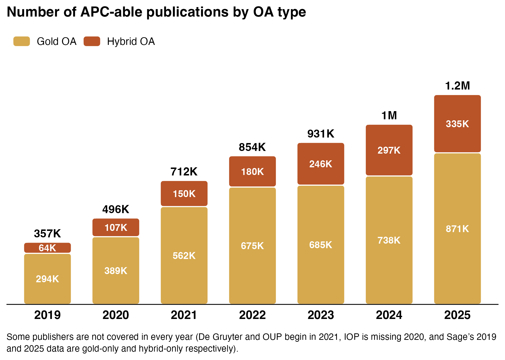
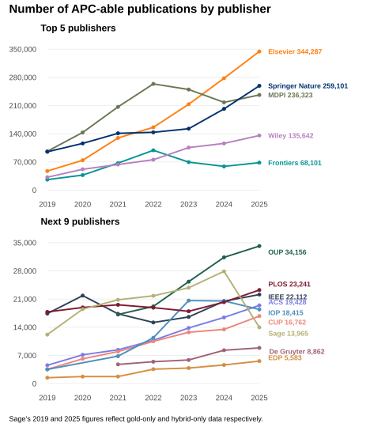
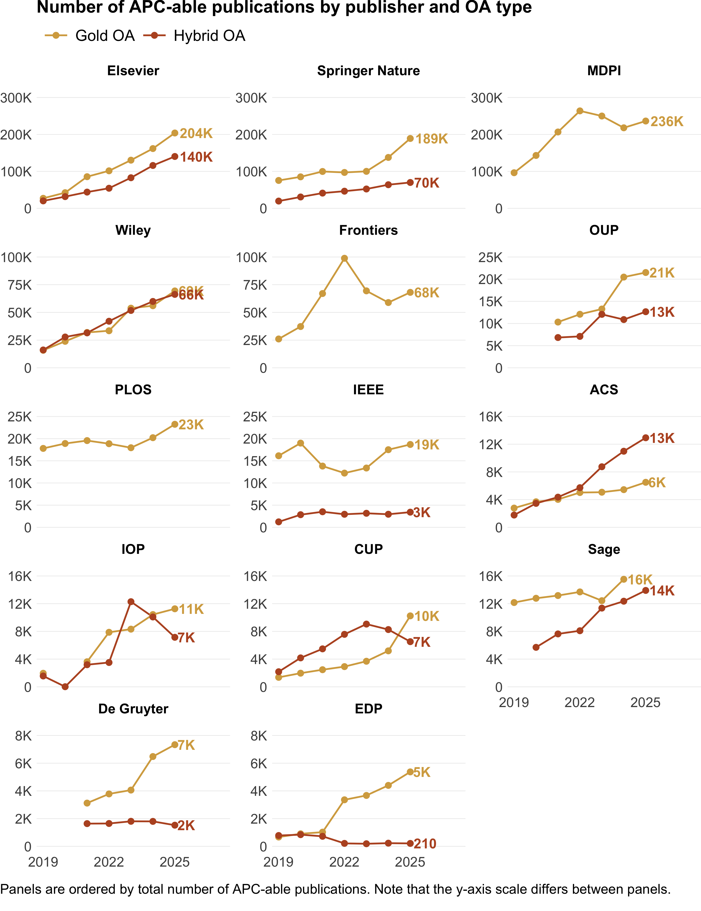

roara_apc_paper_publication_counts
================
Lisa Matthias
2026-07-29

This supplement provides the number of APC-able publications underlying
the spend estimates reported in the main text.

### Table S3.1 Number of APC-able publications per OA type, 2019–2025.

<table class="table" style="width: auto !important; margin-left: auto; margin-right: auto;">

<caption>

Table S3.1 Number of APC-able publications per OA type, 2019–2025.
</caption>

<thead>

<tr>

<th style="text-align:left;">

Publication year
</th>

<th style="text-align:right;">

Gold
</th>

<th style="text-align:right;">

Hybrid
</th>

</tr>

</thead>

<tbody>

<tr>

<td style="text-align:left;">

2019
</td>

<td style="text-align:right;">

293,735
</td>

<td style="text-align:right;">

63,506
</td>

</tr>

<tr>

<td style="text-align:left;">

2020
</td>

<td style="text-align:right;">

389,165
</td>

<td style="text-align:right;">

107,320
</td>

</tr>

<tr>

<td style="text-align:left;">

2021
</td>

<td style="text-align:right;">

562,126
</td>

<td style="text-align:right;">

150,099
</td>

</tr>

<tr>

<td style="text-align:left;">

2022
</td>

<td style="text-align:right;">

674,564
</td>

<td style="text-align:right;">

179,623
</td>

</tr>

<tr>

<td style="text-align:left;">

2023
</td>

<td style="text-align:right;">

685,441
</td>

<td style="text-align:right;">

245,595
</td>

</tr>

<tr>

<td style="text-align:left;">

2024
</td>

<td style="text-align:right;">

738,105
</td>

<td style="text-align:right;">

297,365
</td>

</tr>

<tr>

<td style="text-align:left;">

2025
</td>

<td style="text-align:right;">

871,024
</td>

<td style="text-align:right;">

334,954
</td>

</tr>

<tr>

<td style="text-align:left;">

2019-2025
</td>

<td style="text-align:right;">

4,214,160
</td>

<td style="text-align:right;">

1,378,462
</td>

</tr>

</tbody>

</table>

## OA type

### Figure S3.2 Number of APC-able publications per OA type, 2019–2025.

## Publisher

### Figure S3.3 Number of APC-able publications by publisher, 2019–2025.

### Figure S3.4 Number of APC-able publications by publisher and OA type, 2019–2025.

    ## quartz_off_screen 
    ##                 2

(For the published version, dashed lines were added with Adobe
Illustrator)
